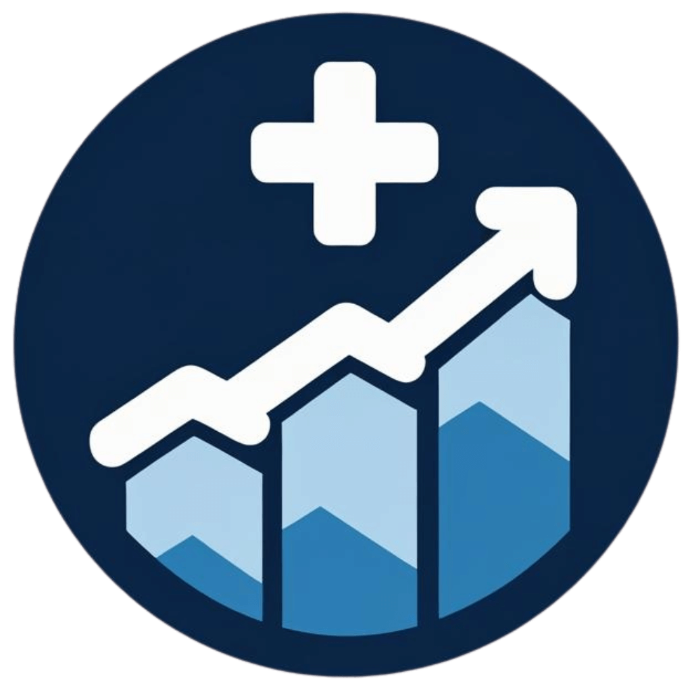

<div align="center">
  
</div>

# 🚀 DocScale - Digital Growth for Doctors

Welcome to **DocScale**, your premier partner for modern digital marketing and lead generation for doctors and clinics. This project is the front end for the **DocScale** business, designed to attract new clients and showcase our expertise in building powerful online platforms for the healthcare industry.

Our mission is to empower doctors to build a strong online presence, attract new patients, and scale their practice efficiently using cutting-edge technology and tailored digital strategies.

---

### ✨ Features of the DocScale Website

This website is a full-service platform that communicates our value to potential clients. It includes:

* **Professional, Modern Design:** A clean and elegant user interface that builds trust and credibility.
* **Comprehensive Service Showcase:** Detailed sections on Website Design, SEO, Online Reputation Management, and Content Marketing.
* **Transparent Pricing:** A clear, tiered pricing model to help potential clients find the right plan for their practice.
* **Live Case Study:** A dedicated section with a link to a live demo website, serving as tangible proof of our work.
* **Thought Leadership Blog:** A integrated blog for publishing high-quality, SEO-optimized content to establish industry authority.
* **Clinic SEO Auditor Tool:** A free, built-in tool (`/tools/seo-auditor`) that allows doctors to instantly check their website's health, SEO score, and mobile responsiveness.
* **Dynamic Demo Template:** A "Chameleon" preview tool (`/demo/preview`) that allows us to instantly generate personalized website mockups for prospective clients.

---

### 💻 How to Edit This Project

This project is built with standard web technologies, making it easy to edit using your preferred development environment.

**Prerequisites**

You'll need to have [Node.js & npm](https://github.com/nvm-sh/nvm#installing-and-updating) installed to run the project locally.

**Local Development**

Follow these steps to get a local copy of the project up and running:

```sh
# Step 1: Clone the repository
git clone <YOUR_GIT_URL>

# Step 2: Navigate to the project directory.
cd <YOUR_PROJECT_NAME>

# Step 3: Install the dependencies.
npm i

# Step 4: Start the development server.
npm run dev
```

### 🛠️ Technologies Used

This project is built with a modern and efficient technology stack to ensure high performance and easy scalability.

- **Vite:** A fast build tool for front-end development.
- **TypeScript:** A statically typed superset of JavaScript that improves code quality.
- **React:** A popular JavaScript library for building user interfaces.
- **shadcn-ui:** A collection of reusable UI components for building beautiful dashboards and websites.
- **Tailwind CSS:** A utility-first CSS framework for rapid UI development.